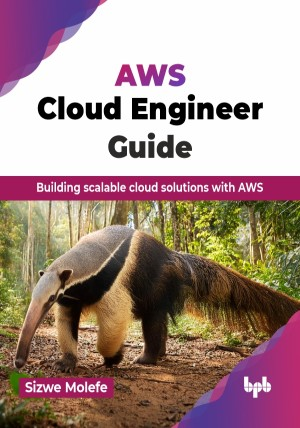

# AWS Cloud Engineer Guide

Building scalable cloud solutions with AWS.

This is the repository for [AWS Cloud Engineer Guide
](https://bpbonline.com/products/aws-cloud-engineer-guide?variant=44136819130568),published by BPB Publications.

## About the Book
Cloud computing provides a more efficient, reliable, secure, and cost-effective way to run applications. Cloud computing offers customers access to rapidly growing amounts of data storage and computation resources while centralizing IT operations in the cloud provider's datacenter or in colocation data centers.

Understand AWS basics such as EC2, VPCs, S3, and IAM while learning to design secure and scalable cloud architectures. This book guides you through automating infrastructure with CloudFormation and exploring advanced topics like containers, continuous integration and continuous delivery (CI/CD) pipelines, and cloud migration. You will also discover serverless computing with Lambda, API Gateway, and DynamoDB, enabling you to build efficient, modern applications. With real-world examples and best practices, this resource helps you optimize your AWS environment for both performance and cost, ensuring you can build and maintain robust cloud solutions.

By the end of this book, you will be able to confidently design, build, and operate scalable and secure cloud solutions on AWS. Gain the expertise to leverage the full potential of cloud computing and drive innovation in your organization.

## What You Will Learn
• How to get started with and launch EC2 instances.

• Working with and simplifying VPC’s, security groups, and network access control lists on AWS.

• Learn how to secure your AWS environment through the use of IAM roles and policies.

• Learn how to build scalable and fault-tolerant database systems using AWS database services such as RDS and Aurora.

• Learn how to set up a CI/CD pipeline on AWS.
